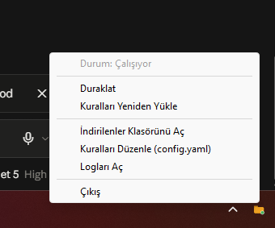
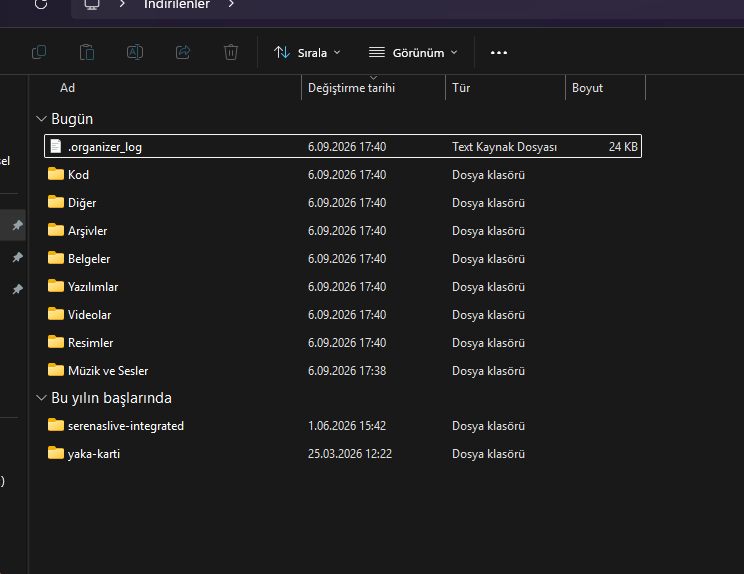
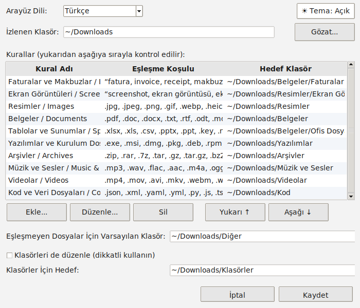
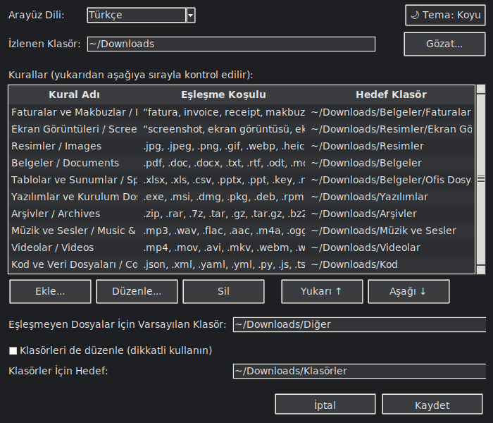

# İndirilenler Klasörü Otomatik Düzenleyici / Downloads Folder Auto-Organizer

*(English version below the Turkish one — kısayol: [English version](#downloads-folder-auto-organizer-english))*

`Downloads` klasörünüzü arka planda izler, yeni gelen her dosyayı
`config.yaml` içindeki kurallara göre (uzantı, dosya adı veya yaş) doğru
alt klasöre taşır. Sistem tepsisinde sessizce çalışır; simgeye
tıklayarak duraklatabilir, kuralları düzenleyebilir veya kapatabilirsiniz.
Hem tepsi menüsü hem log mesajları Türkçe veya İngilizce olarak
çalışabilir (`config.yaml` içindeki `language` ayarı).

## Ekran görüntüleri

| Sistem tepsisi menüsü | Otomatik düzenlenmiş İndirilenler | Ayarlar (Açık tema) | Ayarlar (Koyu tema) |
| --- | --- | --- | --- |
|  |  |  |  |

## İçindekiler

- `organizer.py` — izleme ve taşıma mantığı (watchdog)
- `tray_app.py` — sistem tepsisi arayüzü (pystray) — **çalıştıracağınız dosya budur**
- `settings_gui.py` — "Ayarlar" penceresi (tkinter) — kuralları YAML dosyasını
  elle düzenlemeden görsel olarak yönetme
- `config_writer.py` — Ayarlar penceresinin `config.yaml`'ı güvenli şekilde
  yeniden yazmasını sağlayan yardımcı modül
- `theme.py` — Ayarlar penceresinin açık/koyu (light/dark) tema desteği
- `i18n.py` — Türkçe/İngilizce arayüz metinleri
- `autostart.py` — "Bilgisayar Açılışında Başlat" özelliği (Windows/macOS/Linux)
- `platform_backend/` — Windows/macOS/Linux'a özel kodun (otomatik
  başlatma, dosya açma, tema tespiti, ana uygulama döngüsü) toplandığı
  paket — bkz. aşağıdaki "macOS desteği" bölümü
- `config.yaml` — kurallarınız (dilediğiniz gibi düzenleyin)
- `requirements.txt` — gerekli Python paketleri
- `build_exe.bat` — programı **Python gerektirmeyen tek bir .exe** dosyasına
  dönüştürüp başkalarıyla paylaşmanızı sağlayan Windows betiği
- `app_icon.ico` — .exe dosyasının simgesi
- `build_app.sh` — programı **Python gerektirmeyen bir .app** paketine
  dönüştürüp başkalarıyla paylaşmanızı sağlayan macOS betiği (SADECE
  macOS'ta çalıştırılır)
- `make_icns.py` — `app_icon.ico`'dan macOS `.app` simgesi (`.icns`)
  üreten yardımcı betik; `build_app.sh` tarafından otomatik çağrılır
- `test_organizer.py` — mantığı sahte bir klasörle test eden betik (opsiyonel)

## Kurulum

Python 3.9+ gereklidir.

```bash
cd downloads-organizer
pip install -r requirements.txt
```

## Çalıştırma

```bash
python tray_app.py
```

Sistem tepsisinde (Windows'ta saat yanında, macOS'ta menü çubuğunda,
Linux'ta masaüstü ortamınızın tepsi alanında) turuncu bir klasör simgesi
belirir. Simgeye tıklayınca (Windows/Linux'ta sağ tık) şu menü açılır:

- **Durum**: Çalışıyor / Duraklatıldı (bilgi amaçlı, tıklanamaz)
- **Duraklat / Devam Et**: İzlemeyi geçici olarak durdurur
- **Ayarlar...**: `config.yaml` dosyasını elle açıp düzenlemeden, kuralları
  (kategori adı, uzantılar, hedef klasör) küçük bir pencerede görsel
  olarak ekleyip/düzenleyip/silebileceğiniz ekran — bkz. aşağıdaki
  "Ayarlar Penceresi" bölümü
- **Kuralları Yeniden Yükle**: `config.yaml` dosyasını programı kapatmadan
  tekrar okur — kural değiştirdiğinizde bunu kullanın
- **Şimdi Düzenle (Mevcut Dosyalar)**: `Downloads` klasörünüzde program
  çalışmaya başlamadan önceden duran dosyaları da bir kerelik tarayıp
  kurallara göre taşır. Program normalde sadece **yeni gelen** dosyaları
  yakalar; klasörünüzde zaten biriken eski dosyaları düzenletmek için
  bu düğmeye tıklamanız yeterli.
- **İndirilenler Klasörünü Aç**
- **Kuralları Düzenle (config.yaml)**: ileri düzey seçenek — dosyayı
  doğrudan varsayılan metin editörünüzde açar (çoğu kullanıcı için
  "Ayarlar..." yeterlidir)
- **Logları Aç**: hangi dosyanın nereye taşındığını gösteren log dosyası
- **Bilgisayar Açılışında Başlat**: işaretliyse program bilgisayarınız her
  açıldığında otomatik başlar (bkz. aşağıdaki "Otomatik başlatma" bölümü)
- **Çıkış**

## Ayarlar Penceresi

Çoğu değişiklik için `config.yaml` dosyasını hiç açmanıza gerek yok.
Tepsi menüsünden **"Ayarlar..."**'a tıklayınca açılan pencerede:

- Arayüz dilini (Türkçe/English) değiştirebilir,
- izlenen klasörü görebilir/değiştirebilir,
- kural listesini görebilir; **Ekle...**, **Düzenle...**, **Sil**,
  **Yukarı ↑** / **Aşağı ↓** düğmeleriyle kuralları yönetebilir
  (bir kural: bir ad, virgülle ayrılmış uzantılar ve/veya anahtar
  kelimeler, ve "Gözat..." ile seçilen bir hedef klasör),
- eşleşmeyen dosyalar için varsayılan klasörü,
- ve "klasörleri de düzenle" seçeneğini

görsel olarak ayarlayabilirsiniz. **Kaydet**'e bastığınızda değişiklikler
`config.yaml`'a yazılır ve kurallar otomatik olarak yeniden yüklenir —
ayrıca "Kuralları Yeniden Yükle"ye tıklamanıza gerek yoktur.

Pencerenin sağ üstünde bir **tema düğmesi** bulunur (🖥️ Otomatik /
☀️ Açık / 🌙 Koyu). Tıkladıkça sırayla değişir: "Otomatik" Windows'un
kendi açık/koyu tema ayarını izler, "Açık" ve "Koyu" ise sabit bir
görünüm seçer. Seçiminiz `config.yaml`'daki `ui_theme` ayarına
kaydedilir, bir sonraki açılışta hatırlanır.

Bu pencere Python ile birlikte gelen `tkinter` kütüphanesini kullanır;
ekstra bir kurulum gerektirmez. (Çok nadir durumlarda, Python "tcl/tk"
bileşeni olmadan kurulmuşsa bu menü, dosyayı metin editöründe açan eski
davranışa otomatik olarak geri döner.)

## Standalone .exe Oluşturma (Python gerektirmeden paylaşma)

Bu programı başka insanlara (arkadaşlarınıza, iş arkadaşlarınıza) da
kullandırmak istiyorsanız, onların Python kurmasına, `pip install`
veya `cmd` kullanmasına HİÇ gerek kalmadan çalışan bir **.exe**
oluşturabilirsiniz:

1. Bu klasörde `build_exe.bat` dosyasına **çift tıklayın** (ya da bir
   `cmd` penceresinde `build_exe.bat` yazıp Enter'a basın). Bir kaç
   dakika sürebilir; gerekli `pyinstaller` paketini kendisi kurar.
2. İşlem bitince `dist\IndirilenlerDuzenleyici\` klasörü ve içinde
   `IndirilenlerDuzenleyici.exe` oluşur.
3. Bu **klasörün tamamını** zip'leyip (USB, e-posta, WhatsApp, Google
   Drive vb. ile) istediğiniz kişiye gönderin.

Alıcı tarafta yapılması gereken tek şey: zip'i açıp klasördeki
`IndirilenlerDuzenleyici.exe`'ye çift tıklamak. Program ilk açılışta,
o klasörün içine kendi `config.yaml` dosyasını otomatik olarak
oluşturur (varsayılan kurallarla) ve çalışmaya başlar — Python kurulu
olması bile gerekmez. Sonraki her açılışta aynı klasördeki
`config.yaml`'ı kullanır, yani "Ayarlar" penceresinden yaptıkları
değişiklikler kalıcı olur.

Bu .exe'yi kendi bilgisayarınızda da, Python kurulumuyla uğraşmak
yerine doğrudan kullanmaya devam edebilirsiniz — kaynak koddan
(`python tray_app.py`) çalıştırmakla tamamen aynı şekilde davranır,
sadece dağıtımı çok daha kolaydır.

**Önemli:** `.exe`'yi klasöründen ayırıp tek başına taşımayın/paylaşmayın
— yanındaki `_internal` klasörüne ihtiyacı var, o olmadan açılmaz.
Paylaşırken her zaman `IndirilenlerDuzenleyici` klasörünün tamamını
zip'leyin (nedeni bir alttaki bölümde).

### Antivirüs / Windows Defender / Chrome uyarıları

PyInstaller ile paketlenmiş `.exe` dosyaları — özellikle eskiden
kullandığımız **tek dosyalık ("--onefile")** paketleme biçiminde —
Windows Defender, Chrome'un "Tehlikeli dosya" uyarısı ve Google Safe
Browsing tarafından **yanlış alarm (false positive)** ile sıkça
"zararlı yazılım" olarak işaretlenip otomatik siliniyor. Bunun sebebi
kodun kötü niyetli olması değil: tek-dosya modu, program çalışırken
kendini gizlice bir geçici klasöre açıyor, ve bu davranış tam olarak
zararlı yazılım "dropper"larının kullandığı yönteme benziyor —
antivirüs yazılımları da bu yüzden şüpheleniyor. Bu, PyInstaller
kullanan hemen hemen tüm projelerde yıllardır bilinen, yaygın bir
sorun.

Bunu azaltmak için `build_exe.bat` artık **`--onedir`** (tek dosya
yerine klasör) ve **`--noupx`** (sıkıştırma kapalı) seçenekleriyle
derliyor — ikisi de yanlış alarm oranını ciddi şekilde düşürüyor,
çünkü artık gizli bir kendi kendine açılma davranışı yok. Yine de
%100 garanti değildir; hâlâ bir uyarı görürseniz:

- **Google'a yanlış pozitif bildirin:**
  https://safebrowsing.google.com/safebrowsing/report_error/
- **Microsoft'a bildirin:**
  https://www.microsoft.com/en-us/wdsi/filesubmission
  (genelde birkaç gün içinde inceleyip düzeltiyorlar)
- Kalıcı/en sağlam çözüm **kod imzalama (code signing)** — ücretli bir
  sertifika veya açık kaynak projeler için SignPath gibi ücretsiz
  seçenekler mevcut, ama bu şart değildir.
- Doğrudan kaynak koddan çalıştırmak (`python tray_app.py`) hiçbir
  zaman bu tür bir uyarıya takılmaz, çünkü ortada paketlenmiş bir
  `.exe` yoktur.

## macOS desteği

Program artık macOS'ta da (menü çubuğu simgesi + Ayarlar penceresi +
bilgisayar açılışında otomatik başlatma dahil) tam işlevsel çalışacak
şekilde tasarlandı. Windows/Linux'a özel hiçbir kod değiştirilmedi;
platforma özel tüm mantık `platform_backend/` paketinde toplandı.

**Not:** Bu portu geliştirirken elimde gerçek bir Mac yoktu, bu yüzden
kod incelemeyle ve mantık yürüterek yazıldı; **gerçek bir Mac'te
doğrulanana kadar %100 garantili değildir.** Menü çubuğu simgesinin
görünüp görünmediğini, Ayarlar penceresinin açılıp kapandığını ve
otomatik başlatmanın çalıştığını test edip bana bildirirseniz
sevinirim.

### Kaynaktan çalıştırma

```bash
cd downloads-organizer
python3 -m pip install -r requirements.txt
python3 tray_app.py
```

Sisteminizin Python'ı `tkinter` içermiyorsa (macOS'un kendi Python'ında
bazen eksik olabiliyor), önce şunlardan birini yapın:

- [python.org](https://www.python.org/downloads/macos/) üzerinden
  resmi Python kurulumunu kullanın (tkinter dahildir), **veya**
- Homebrew kullanıyorsanız: `brew install python-tk`

(macOS'un sistemle gelen Tcl/Tk sürümü eski ve bazı görsel sorunlara
yol açabiliyor; yukarıdaki iki seçenek de daha güncel bir Tcl/Tk
kullanır.)

### Standalone .app Oluşturma (Python gerektirmeden paylaşma)

Windows'taki `build_exe.bat`'e paralel bir betik:

```bash
cd downloads-organizer
chmod +x build_app.sh   # bir kere
./build_app.sh
```

Bu betik **SADECE macOS'ta çalışır** (PyInstaller cross-compile
yapamadığı için Windows/Linux'tan bir `.app` üretilemez). Bittiğinde:

- `dist/İndirilenlerDüzenleyici.app` — çift tıklayıp çalıştırabileceğiniz
  uygulama paketi
- `dist/IndirilenlerDuzenleyici-macOS.zip` — başkalarıyla paylaşmaya
  hazır zip

Apple Silicon (M1/M2/…) bir Mac'te derlerseniz sonuç yalnızca Apple
Silicon Mac'lerde çalışır (Intel Mac'te çalışmayabilir) — şu an
`universal2` hedeflenmiyor, çünkü tüm bağımlılıkların (`pystray`,
`watchdog`, `Pillow` vb.) `universal2` bir tekerlek (wheel) sunması
gerekirdi, bu aşamada pratik değil.

### macOS Gatekeeper uyarısı

Ücretli bir Apple Developer sertifikamız olmadığı için `.app` yalnızca
**ad-hoc** (kimliksiz) imzalanıyor. Bu yüzden `.app`'i ilk açtığınızda
(ya da indirdiğinizde) macOS'un Gatekeeper'ı "geliştirici doğrulanamadı"
gibi bir uyarı gösterebilir. Çözümü:

1. **Sağ tıklayın** (ya da Control+tıklayın) `İndirilenlerDüzenleyici.app`'e,
   menüden **"Aç"**'ı seçin, açılan uyarı penceresinde tekrar **"Aç"**'a
   basın. (Çift tıklamak bu uyarıyı ATLATMAZ, sadece sağ tık → Aç
   çalışır — bu Apple'ın kasıtlı bir güvenlik davranışı.)
2. Ya da terminalde karantina işaretini kaldırın:
   ```bash
   xattr -dr com.apple.quarantine /path/to/İndirilenlerDüzenleyici.app
   ```

Bu adımlar yalnızca **ilk açılışta** gerekir.

### macOS'a özel notlar

- Menü çubuğu simgesi görünür ama **Dock'ta hiçbir simge/uygulama
  görünmez** (`Info.plist`'teki `LSUIElement` ayarı sayesinde) — bu
  kasıtlıdır, "arka planda çalışan sessiz bir araç" davranışı içindir.
- **Bilgisayar Açılışında Başlat** menü seçeneği, macOS'ta
  `~/Library/LaunchAgents/com.indirilenlerduzenleyici.plist` adıyla bir
  LaunchAgent oluşturur (Windows'taki kayıt defteri girdisinin
  karşılığı) — elle bir şey yapmanız gerekmez.
- macOS bazı klasörlere (özellikle `Downloads`) erişimi "Gizlilik ve
  Güvenlik" ayarları üzerinden kontrol eder. Program, izlenen
  klasördeki değişiklikleri gerçekten yakalayıp yakalayamadığını arka
  planda kısa bir "kanarya dosyası" testiyle kontrol eder; bir sorun
  tespit ederse log dosyasına (**Logları Aç**) bir uyarı yazar ve sizi
  **Sistem Ayarları → Gizlilik ve Güvenlik → Dosyalar ve Klasörler**'e
  yönlendirir.
- Ekran görüntüsü şu an eklenemedi (bende test edebileceğim bir Mac
  yok) — siz test ederken bir ekran görüntüsü paylaşırsanız buraya
  eklerim.

## Dil (Türkçe / İngilizce)

`config.yaml` dosyasının en üstünde:

```yaml
language: "tr"   # veya "en"
```

Bunu `"en"` yaparsanız tepsi menüsü, log mesajları ve konsol çıktısı
İngilizce olur. Varsayılan kurallardaki `name` alanları (ör. "Resimler
/ Images") zaten iki dilli yazıldığı için, hangi dili seçerseniz seçin
loglarda anlaşılır kalır.

## Kuralları özelleştirme

`config.yaml` dosyasını herhangi bir metin editörüyle açın. İçinde her
kategori için örnekler ve açıklamalar var (Resimler, Belgeler,
Arşivler, Yazılımlar, Müzik ve Sesler, Faturalar vb.). Yeni bir kural
eklemek için:

```yaml
  - name: "Ders Notlarım / Class Notes"
    match:
      name_contains: ["ders", "lecture", "ödev"]
    destination: "~/Downloads/Okul"
```

Kuralı ekledikten sonra dosyayı kaydedin ve tepsi menüsünden
**"Kuralları Yeniden Yükle"**'ye tıklayın — programı yeniden başlatmanıza
gerek yok.

Kurallar **yukarıdan aşağıya** sırayla kontrol edilir, ilk uyan kural
uygulanır. Hiçbiri uymazsa dosya `default_destination`'a taşınır.

**Not — Müzik ve Sesler:** Bu kategori artık sadece müzik dosyalarını
değil (mp3, flac, wav...), tüm ses kayıtlarını da kapsıyor: sesli
notlar (.amr, .caf), podcast/ses dosyaları (.opus, .wma, .aiff),
zil sesleri ve ses efektleri (.3gp, .mid, .midi) gibi. Hepsi tek bir
`Müzik ve Sesler` klasörüne taşınır.

## Klasörleri de düzenleme (opsiyonel)

Program varsayılan olarak yalnızca **dosyaları** taşır; `Downloads`
kökünde duran klasörlere (ör. eski bir proje klasörünüz) hiç dokunmaz.
Bunları da düzenletmek isterseniz `config.yaml`'da:

```yaml
organize_folders: true
folders_destination: "~/Downloads/Klasörler"
```

**Peki bu bir döngüye girer mi?** Hayır — program başlarken, yukarıdaki
tüm kuralların (`destination`), `default_destination`'ın ve
`folders_destination`'ın hangi üst klasörlere karşılık geldiğini
otomatik hesaplar ve bu klasörleri (Resimler, Belgeler, Arşivler,
Diğer, Klasörler vb.) **kalıcı olarak korumaya alır** — bunlar asla
tekrar taşınmaz. Yani "Şimdi Düzenle"ye on kere art arda tıklasanız
da, ya da program sürekli açık kalsa da, kendi oluşturduğu klasörleri
bir daha asla kendi içine ya da başka bir yere taşımaz; yalnızca
**sizin** oluşturduğunuz/indirdiğiniz diğer klasörleri taşır. Bu
yüzden varsayılan olarak kapalı tutuyoruz: bir klasörü, içine hâlâ
dosya kopyalanırken taşımak o kopyalama işlemini bozabilir — sadece
"durmuş", tamamlanmış klasörleriniz için açmanızı öneririz.

Ayarı değiştirdikten sonra tepsi menüsünden **"Kuralları Yeniden
Yükle"**'ye, ardından mevcut klasörlerinizi de düzenletmek için
**"Şimdi Düzenle (Mevcut Dosyalar)"**'a tıklamanız yeterli.

## Bilgisayar açılışında otomatik başlatma

**En kolay yol:** Program çalışırken tepsi menüsünden **"Bilgisayar
Açılışında Başlat"** seçeneğine tıklayın. Uygulama, işletim sisteminize
göre gerekli kaydı kendisi oluşturur (Windows'ta kayıt defteri,
macOS'ta LaunchAgent, Linux'ta autostart girdisi) — elle hiçbir şey
yapmanıza gerek yok. Tekrar tıklarsanız kapatılır.

Bu otomatik yöntem bir sebeple çalışmazsa (örneğin kısıtlı bir
kullanıcı hesabındaysanız), aşağıdaki elle kurulum adımlarını
kullanabilirsiniz:

### Windows (elle kurulum)

1. `Win + R` tuşlarına basın, `shell:startup` yazıp Enter'a basın —
   açılan klasör Başlangıç klasörünüzdür.
2. `tray_app.py` dosyasının kısayolunu bu klasöre kopyalayın. Kısayol
   oluştururken hedef olarak şunu kullanabilirsiniz (kendi yollarınızla
   değiştirin):
   ```
   pythonw.exe "C:\...\downloads-organizer\tray_app.py"
   ```
   `pythonw.exe` kullanmak, açılışta siyah bir konsol penceresi
   belirmesini engeller.

### macOS (elle kurulum)

Yukarıdaki "Bilgisayar Açılışında Başlat" menü seçeneği zaten tam
olarak aşağıdakini kendisi yapıyor — bunu yalnızca o seçenek bir
sebeple çalışmazsa kullanın.
`~/Library/LaunchAgents/com.indirilenlerduzenleyici.plist` adıyla
aşağıdaki içerikte bir dosya oluşturun (yolları kendinize göre
düzenleyin):

```xml
<?xml version="1.0" encoding="UTF-8"?>
<!DOCTYPE plist PUBLIC "-//Apple//DTD PLIST 1.0//EN"
  "http://www.apple.com/DTDs/PropertyList-1.0.dtd">
<plist version="1.0">
<dict>
  <key>Label</key><string>com.indirilenlerduzenleyici</string>
  <key>ProgramArguments</key>
  <array>
    <string>/usr/bin/python3</string>
    <string>/Users/KULLANICI_ADINIZ/downloads-organizer/tray_app.py</string>
  </array>
  <key>RunAtLoad</key><true/>
</dict>
</plist>
```

Sonra terminalde:

```bash
launchctl load ~/Library/LaunchAgents/com.indirilenlerduzenleyici.plist
```

### Linux (elle kurulum)

Masaüstü ortamınızın "Başlangıç Uygulamaları" ayarına ekleyin ya da
`~/.config/autostart/downloads-organizer.desktop` dosyası oluşturun:

```ini
[Desktop Entry]
Type=Application
Name=İndirilenler Düzenleyici
Exec=python3 /home/KULLANICI_ADINIZ/downloads-organizer/tray_app.py
X-GNOME-Autostart-enabled=true
```

## Nasıl çalışır (kısaca)

1. `watchdog` kütüphanesi `Downloads` klasörünü dinler.
2. Yeni bir dosya oluştuğunda (veya tarayıcının `.crdownload` gibi
   geçici bir isimden asıl isme yeniden adlandırmasında), program
   dosyanın **boyutunun sabitlenmesini bekler** (indirme bitmeden
   taşımamak için).
3. Dosya, `config.yaml`'daki kuralları sırayla kontrol eder; ilk uyan
   kuralın hedef klasörüne taşınır. Hedefte aynı isimde dosya varsa
   `isim (1).uzanti` şeklinde güvenli bir isim kullanılır.
4. Her işlem, `İndirilenler/.organizer_log.txt` dosyasına (ve konsola)
   yazılır.

## Test etme

Gerçek `Downloads` klasörünüze dokunmadan mantığı sınamak isterseniz:

```bash
python test_organizer.py
```

Bu betik geçici bir klasörde örnek dosyalar oluşturur, taşıma
mantığını çalıştırır ve sonuçları doğrular; hiçbir gerçek dosyanıza
dokunmaz.

## Bilinen sınırlamalar / notlar

- Program yalnızca **siz çalıştırdığınız sürece** aktiftir; bilgisayar
  yeniden başladığında tekrar çalışması için yukarıdaki "otomatik
  başlatma" adımlarından birini kurmanız gerekir.
- Alt klasörler (`Downloads` içindeki klasörler) izlenmez, sadece
  doğrudan `Downloads` köküne inen dosyalar kontrol edilir — bu
  sayede program kendi oluşturduğu klasörlere (Resimler, Belgeler vb.)
  tekrar tekrar bakıp durmaz.
- Çok büyük dosyalarda (birkaç GB) indirme bitmeden `stability_check_seconds`
  süresi dolabilir; gerekirse bu değeri `config.yaml`'da artırabilirsiniz.

## Lisans

Bu proje [MIT Lisansı](LICENSE) ile lisanslanmıştır — dilediğiniz gibi
kullanabilir, değiştirebilir ve paylaşabilirsiniz.

---

# Downloads Folder Auto-Organizer (English)

*(Türkçe sürüm için yukarı bakın — see the Turkish version above)*

Watches your `Downloads` folder in the background and moves every new
file into the right subfolder based on the rules in `config.yaml`
(by extension, filename, or age). Runs quietly in the system tray;
click the icon to pause it, edit the rules, or quit. Both the tray
menu and the log messages can run in Turkish or English (see the
`language` setting in `config.yaml`).

## Screenshots

| Tray menu | Auto-organized Downloads | Settings (Light theme) | Settings (Dark theme) |
| --- | --- | --- | --- |
|  |  |  |  |

## Contents

- `organizer.py` — the watching and moving logic (watchdog)
- `tray_app.py` — the system tray UI (pystray) — **this is the file you run**
- `settings_gui.py` — the "Settings" window (tkinter) — manage rules visually
  instead of hand-editing the YAML file
- `config_writer.py` — helper module that lets the Settings window safely
  rewrite `config.yaml`
- `theme.py` — light/dark theme support for the Settings window
- `i18n.py` — Turkish/English interface strings
- `autostart.py` — the "Start at Computer Login" feature (Windows/macOS/Linux)
- `platform_backend/` — the package where all Windows/macOS/Linux-specific
  code lives (autostart, opening files, theme detection, the main app
  loop) — see "macOS support" below
- `config.yaml` — your rules (edit freely)
- `requirements.txt` — required Python packages
- `build_exe.bat` — a Windows script that packages the app into a **single
  .exe that needs no Python install**, for sharing with other people
- `app_icon.ico` — the icon used for that .exe
- `build_app.sh` — a macOS script that packages the app into a **.app
  bundle that needs no Python install**, for sharing with other people
  (runs on macOS ONLY)
- `make_icns.py` — a helper script that builds the macOS app icon
  (`.icns`) from `app_icon.ico`; called automatically by `build_app.sh`
- `test_organizer.py` — a script that tests the logic against a fake folder (optional)

## Setup

Requires Python 3.9+.

```bash
cd downloads-organizer
pip install -r requirements.txt
```

## Running it

```bash
python tray_app.py
```

An orange folder icon appears in your system tray (next to the clock
on Windows, in the menu bar on macOS, in your desktop environment's
tray area on Linux). Click it (right-click on Windows/Linux) to open
the menu:

- **Status**: Running / Paused (informational, not clickable)
- **Pause / Resume**: temporarily stop watching
- **Settings...**: opens a small window where you can add/edit/delete rules
  visually, without ever opening `config.yaml` — see "Settings Window" below
- **Reload Rules**: re-reads `config.yaml` without restarting the app —
  use this after editing rules
- **Organize Now (Existing Files)**: does a one-time scan of files that
  were already sitting in `Downloads` before the app started, and moves
  them per your rules. The watcher normally only catches **new**
  arrivals — click this to clean up what's already piled up.
- **Open Downloads Folder**
- **Edit Rules (config.yaml)**: advanced option — opens the file directly
  in your default text editor (most people won't need this; use
  "Settings..." instead)
- **Open Logs**: the log file showing what was moved where
- **Start at Computer Login**: when checked, the app launches
  automatically every time you log in (see "Auto-start on boot" below)
- **Quit**

## Settings Window

For most changes you never need to open `config.yaml` at all. Click
**"Settings..."** in the tray menu to:

- change the interface language (Turkish/English),
- view/change the watched folder,
- manage the rule list with **Add...**, **Edit...**, **Delete**,
  **Move Up ↑** / **Move Down ↓** (a rule is: a name, comma-separated
  extensions and/or keywords, and a destination folder picked via
  "Browse..."),
- set the default folder for unmatched files,
- and toggle "also organize folders".

Clicking **Save** writes the changes to `config.yaml` and reloads the
rules automatically — no need to also click "Reload Rules".

There's a **theme button** in the top-right corner (🖥️ Auto / ☀️ Light /
🌙 Dark). Clicking it cycles through the three modes: "Auto" follows
Windows' own light/dark setting, while "Light" and "Dark" pin a fixed
look. Your choice is saved to the `ui_theme` setting in `config.yaml`
and remembered the next time you open the window.

This window uses Python's built-in `tkinter` library, so it needs no
extra install. (In the rare case Python was installed without its
"tcl/tk" component, this menu item falls back to opening the file in
a text editor instead.)

## Building a Standalone .exe (share it without Python)

Want other people — friends, coworkers — to use this app without
ever installing Python, running `pip`, or touching a command line?
You can package it into a **single .exe file**:

1. Double-click `build_exe.bat` in this folder (or run it from a
   `cmd` window). It takes a couple of minutes and installs
   `pyinstaller` on its own if needed.
2. When it finishes, the `dist\IndirilenlerDuzenleyici\` folder is
   ready, containing `IndirilenlerDuzenleyici.exe`.
3. Zip up **that whole folder** and send it (USB drive, email, cloud
   drive, whatever) to anyone you want to share it with.

All the recipient has to do is unzip it and double-click
`IndirilenlerDuzenleyici.exe` inside. On first run, the app creates
its own `config.yaml` right next to itself (with the default rules)
and starts working — they don't even need Python installed. Every
later run reuses that same `config.yaml`, so any changes made through
the Settings window are kept.

You can keep using this .exe on your own computer too, instead of
dealing with a Python install — it behaves exactly like running from
source (`python tray_app.py`), it's just much easier to hand to
someone else.

**Important:** don't move or share the `.exe` by itself, separated
from its folder — it needs the `_internal` folder next to it to run.
Always zip up the whole `IndirilenlerDuzenleyici` folder (see why in
the next section).

### Antivirus / Windows Defender / Chrome warnings

`.exe` files packaged with PyInstaller — especially with the
**single-file ("--onefile")** mode we used to use — are frequently
flagged as "malware" and auto-deleted by Windows Defender, Chrome's
"Dangerous file" warning, and Google Safe Browsing, as a **false
positive**. This isn't because the code is malicious: single-file
mode silently unpacks itself into a temporary folder at runtime, and
that behavior looks a lot like what malware "droppers" do — so
antivirus software gets suspicious. This is a common, years-long,
well-documented issue with pretty much every PyInstaller-based
project, not something specific to this app.

To reduce it, `build_exe.bat` now builds with **`--onedir`** (a
folder instead of a single file) and **`--noupx`** (compression
disabled) — both meaningfully lower the false-positive rate, since
there's no more hidden self-extraction. It's not a 100% guarantee
though; if you still see a warning:

- **Report the false positive to Google:**
  https://safebrowsing.google.com/safebrowsing/report_error/
- **Report it to Microsoft:**
  https://www.microsoft.com/en-us/wdsi/filesubmission
  (usually reviewed and fixed within a few days)
- The most durable fix is **code signing** — a paid certificate, or
  free options like SignPath for open-source projects — but it's not
  required.
- Running straight from source (`python tray_app.py`) never triggers
  this kind of warning at all, since there's no packaged `.exe`
  involved.

## macOS support

The app is now designed to be fully functional on macOS too (menu bar
icon, Settings window, and start-at-login included). No Windows/Linux
code was changed — all platform-specific logic was moved into the
`platform_backend/` package.

**Note:** this port was written without access to real Mac hardware —
it was built by careful code reading and reasoning, so **it isn't
guaranteed correct until verified on a real Mac.** If you test it and
can confirm the menu bar icon shows up, the Settings window opens and
closes properly, and start-at-login works, I'd appreciate hearing
about it.

### Running from source

```bash
cd downloads-organizer
python3 -m pip install -r requirements.txt
python3 tray_app.py
```

If your Python doesn't include `tkinter` (sometimes missing from
macOS's bundled Python), first do one of:

- use the official installer from
  [python.org](https://www.python.org/downloads/macos/) (tkinter is
  included), **or**
- if you use Homebrew: `brew install python-tk`

(macOS's system Tcl/Tk is old and can cause some visual glitches;
both options above use a more current Tcl/Tk.)

### Building a Standalone .app (share it without Python)

A script that parallels `build_exe.bat` on the Windows side:

```bash
cd downloads-organizer
chmod +x build_app.sh   # once
./build_app.sh
```

This script **only runs on macOS** (PyInstaller can't cross-compile,
so a `.app` can't be built from Windows/Linux). When it finishes:

- `dist/İndirilenlerDüzenleyici.app` — the app bundle, double-click to run
- `dist/IndirilenlerDuzenleyici-macOS.zip` — a zip ready to share with
  other people

If you build on Apple Silicon (M1/M2/…), the result will only run on
Apple Silicon Macs (it may not run on an Intel Mac) — `universal2`
isn't targeted right now, since that would require every dependency
(`pystray`, `watchdog`, `Pillow`, etc.) to ship a `universal2` wheel,
which isn't practical at this stage.

### macOS Gatekeeper warning

Since we don't have a paid Apple Developer certificate, the `.app` is
only signed **ad-hoc** (identity-less). Because of that, the first
time you open it (or download it), macOS's Gatekeeper may show a
warning like "developer cannot be verified". To get past it:

1. **Right-click** (or Control-click) `İndirilenlerDüzenleyici.app`,
   choose **"Open"** from the menu, then click **"Open"** again in the
   dialog that appears. (Double-clicking does NOT bypass this warning —
   only right-click → Open works; this is intentional Apple security
   behavior.)
2. Or clear the quarantine flag from a terminal:
   ```bash
   xattr -dr com.apple.quarantine /path/to/İndirilenlerDüzenleyici.app
   ```

These steps are only needed the **first time** you open it.

### macOS-specific notes

- The menu bar icon shows up, but **no icon/app appears in the Dock**
  (thanks to the `LSUIElement` setting in `Info.plist`) — this is
  intentional, matching a "quiet background tool" behavior.
- The **Start at Computer Login** menu item creates a LaunchAgent on
  macOS at `~/Library/LaunchAgents/com.indirilenlerduzenleyici.plist`
  (the macOS equivalent of the Windows Registry entry) — no manual
  steps needed.
- macOS controls access to certain folders (especially `Downloads`)
  through its Privacy & Security settings. The app runs a short
  background "canary file" check to verify it's actually catching
  changes in the watched folder; if it detects a problem, it logs a
  warning (see **Open Logs**) pointing you to **System Settings →
  Privacy & Security → Files and Folders**.
- No screenshot yet (I don't have a Mac to test on) — if you share one
  after testing, I'll add it here.

## Language (Turkish / English)

At the top of `config.yaml`:

```yaml
language: "tr"   # or "en"
```

Set it to `"en"` and the tray menu, log messages, and console output
switch to English. The default rules' `name` fields (e.g. "Resimler /
Images") are already written bilingually, so they stay readable no
matter which language you pick.

## Customizing the rules

Open `config.yaml` in any text editor. It has examples and comments
for every category (Images, Documents, Archives, Software, Music &
Sounds, Invoices, etc.). To add a new rule:

```yaml
  - name: "Class Notes / Ders Notlarım"
    match:
      name_contains: ["lecture", "ders", "homework"]
    destination: "~/Downloads/School"
```

After adding a rule, save the file and click **"Reload Rules"** in the
tray menu — no need to restart the program.

Rules are checked **top to bottom**, and the first one that matches
wins. If none match, the file goes to `default_destination`.

**Note — Music & Sounds:** this category now covers more than just
music files (mp3, flac, wav...) — it also catches voice memos (.amr,
.caf), podcast/audio files (.opus, .wma, .aiff), ringtones and sound
effects (.3gp, .mid, .midi), and more. All of them are moved into a
single `Müzik ve Sesler` (Music & Sounds) folder.

## Organizing folders too (optional)

By default the app only moves **files** — it never touches folders
sitting in the `Downloads` root (like an old project folder). To have
it organize those too, set in `config.yaml`:

```yaml
organize_folders: true
folders_destination: "~/Downloads/Klasörler"
```

**Won't this loop?** No — on startup, the app automatically computes
which top-level folder every rule's `destination`, the
`default_destination`, and `folders_destination` resolve to, and
**permanently protects** those folders (Images, Documents, Archives,
Other, Folders, etc.) — they are never moved again. So whether you
click "Organize Now" ten times in a row, or leave the app running
forever, it will never move its own category folders into themselves
or anywhere else; it only ever moves **other** folders you created or
downloaded. It's off by default because moving a folder while
something is still being copied into it could break that operation —
we recommend enabling it only for folders that are done and settled.

After changing the setting, click **"Reload Rules"** in the tray menu,
then **"Organize Now (Existing Files)"** to also sort out folders that
are already sitting there.

## Auto-start on boot

**Easiest way:** while the app is running, click **"Start at Computer
Login"** in the tray menu. It creates whatever the OS needs on its own
(a Windows Registry entry, a macOS LaunchAgent, or a Linux autostart
entry) — no manual steps required. Click it again to turn it off.

If that doesn't work for some reason (e.g. a restricted user account),
use the manual steps below instead.

### Windows (manual setup)

1. Press `Win + R`, type `shell:startup`, press Enter — this opens
   your Startup folder.
2. Copy a shortcut to `tray_app.py` into that folder. When creating
   the shortcut, you can use this as the target (adjust the path):
   ```
   pythonw.exe "C:\...\downloads-organizer\tray_app.py"
   ```
   Using `pythonw.exe` avoids a black console window popping up on boot.

### macOS (manual setup)

The "Start at Computer Login" tray menu item above already does
exactly this for you — only use this if that option doesn't work for
some reason. Create a file named
`~/Library/LaunchAgents/com.indirilenlerduzenleyici.plist` with this
content (adjust the paths):

```xml
<?xml version="1.0" encoding="UTF-8"?>
<!DOCTYPE plist PUBLIC "-//Apple//DTD PLIST 1.0//EN"
  "http://www.apple.com/DTDs/PropertyList-1.0.dtd">
<plist version="1.0">
<dict>
  <key>Label</key><string>com.indirilenlerduzenleyici</string>
  <key>ProgramArguments</key>
  <array>
    <string>/usr/bin/python3</string>
    <string>/Users/YOUR_USERNAME/downloads-organizer/tray_app.py</string>
  </array>
  <key>RunAtLoad</key><true/>
</dict>
</plist>
```

Then in a terminal:

```bash
launchctl load ~/Library/LaunchAgents/com.indirilenlerduzenleyici.plist
```

### Linux (manual setup)

Add it to your desktop environment's "Startup Applications" settings,
or create `~/.config/autostart/downloads-organizer.desktop`:

```ini
[Desktop Entry]
Type=Application
Name=Downloads Organizer
Exec=python3 /home/YOUR_USERNAME/downloads-organizer/tray_app.py
X-GNOME-Autostart-enabled=true
```

## How it works (briefly)

1. The `watchdog` library listens to your `Downloads` folder.
2. When a new file appears (or a browser renames a temporary name like
   `.crdownload` to the final filename), the program **waits for the
   file's size to stop changing** so it doesn't move a file that's
   still downloading.
3. The file is checked against the rules in `config.yaml` in order;
   it's moved to the first matching rule's destination folder. If a
   file with the same name already exists there, a safe name like
   `name (1).ext` is used instead.
4. Every action is written to `Downloads/.organizer_log.txt` (and the console).

## Testing

To test the logic without touching your real `Downloads` folder:

```bash
python test_organizer.py
```

This script creates sample files in a temporary folder, runs the
move logic against them, and verifies the results — it never touches
your real files.

## Known limitations / notes

- The program is only active **while you're running it**; to have it
  running again after a reboot, set up one of the "auto-start" methods
  above.
- Subfolders inside `Downloads` are not watched — only files that land
  directly in the `Downloads` root are checked. This keeps the program
  from repeatedly scanning the folders it creates itself (Images,
  Documents, etc.).
- For very large files (several GB), the `stability_check_seconds`
  window might elapse before the download finishes; increase that
  value in `config.yaml` if needed.

## License

This project is licensed under the [MIT License](LICENSE) — use,
modify, and share it freely.
